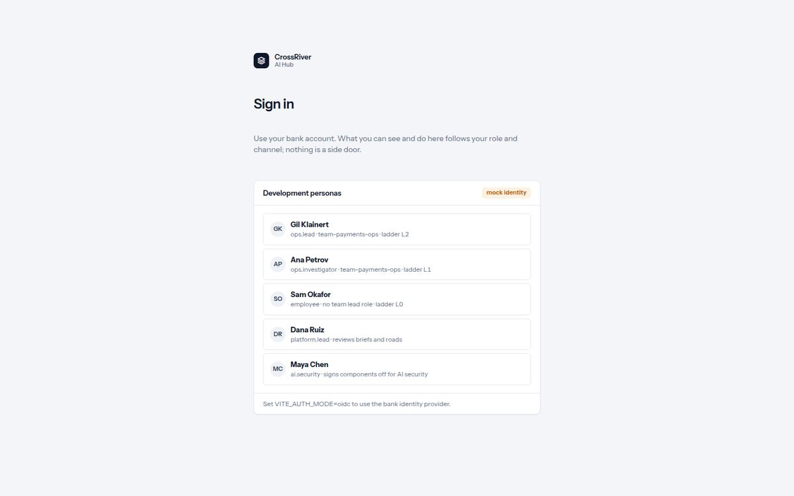

# 1. Signing in

*One button. The hub never sees your password.*

*The sign-in page. In a sandbox it also lists the development personas; in production there is one button.*

| You see | It means |
| --- | --- |
| `Sign in` · `Use your bank account. What you can see and do here follows your role and channel; nothing is a side door.` | You sign in with the account you use for everything else. The company's identity provider tells the hub who you are and which groups you are in. What you then see is decided by those groups, never by asking nicely. |
| `Continue with … sign-in` | The one button. It carries the bank's name. Clicking it goes to the identity provider and back. |
| `Development personas` · `mock identity` | Only in a sandbox: a list of pretend people to sign in as (an operations lead, an investigator, an employee, a platform lead, a security engineer). You will not see this in production. |
| `Signing you in…` | The hub is waiting for the identity provider, then for the platform to say who you are. |
| `Your role does not allow this` | You are signed in, but this page or action is not open to your role. The page offers `Back to Discover` and `Sign in as someone else`. |

1. **Open the hub's address and press the sign-in button.**  
   You are sent to the identity provider and back; there is nothing to type on the hub itself.
2. **Land on Discover.**  
   The first screen is the catalog, with what you may use today at the top.
3. **If something you expected is missing, that is access, not a fault.**  
   Every card and page has a button to ask for it. See "Ask for access" below.
