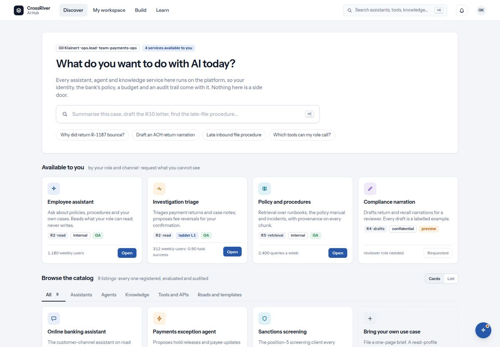

# 3. Discover

*The catalog: what you may use today, and what you can ask for.*

*Discover: what you may use today at the top, the catalog by kind below.*

| You see | It means |
| --- | --- |
| `What do you want to do with AI today?` | The page's question. Under it, one line says every service here runs on the platform, so your identity, the bank's policy, a budget and an audit trail come with it. |
| `Summarise this case, draft the R10 letter, find the late-file procedure…` | The search box, with examples of what people type. Typing a question offers to ask the assistant. |
| `Available to you` · `by your role and channel · request what you cannot see` | The row of cards you can open right now. It is worked out per person. |
| Chips on a card: `R2 · read` `internal` `GA` `preview` `ladder L1` | The road and profile (R2 · read means an internal agent that only reads), the data class it touches, and whether it is generally available. GA means two named people signed this version. Preview means it is still earning them. |
| Card buttons: `Open` · `View` · `Read contract` · `Request access` · `Requested` | Open starts using it. View shows the listing without access. Read contract is for a service under a contract. Request access asks your lead; Requested means you already did. |
| `Browse the catalog` · tabs `All` `Assistants` `Agents` `Knowledge` `Tools and APIs` `Roads and templates` | Everything, by kind. The collection's components sit under their kind with a stage chip such as `agent · ready`. The count line says every listing is registered, evaluated and audited. |
| `Cards` / `List` | The same catalog as cards or as a table with Listing, Kind, Road, Lifecycle and Access columns. |
| `Nothing in this part of the catalog is visible to your role yet.` | An empty tab is about access, not about the catalog being empty. |
| `Bring your own use case` · `Start a brief` | The way to propose something new. One page; the lead confirms only the road, within two working days. |
| `Building something for your team?` · tiles `6 weeks` `2 weeks` `15 min` | What the paved road gives an engineer: six weeks from intake to production for a read profile, two weeks to a sandbox with an embedded engineer, a runnable example in fifteen minutes. |
| `What changed this week` · `All updates` | New and changed listings since last week. |

## Find and open something, step by step

1. **Look at the row under "Available to you" first.**  
   Anything there opens with one click and runs as you.
2. **Not there? Pick a tab under "Browse the catalog" or press ⌘K and type a word.**  
   The tabs split by kind; search finds anything your role may see.
3. **Read the chips before opening.**  
   The road says what kind of thing it is, the data chip what it touches, and GA or preview whether it is signed.
4. **Press Open for an assistant, or View for a listing.**  
   An assistant opens a conversation. Everything else opens its listing page, described in section 4.

## Ask for access, step by step

1. **On the card or its listing, press "Request access" (or "Request ladder" for more autonomy).**  
   The hub only routes the ask; the platform's policy decides.
2. **See the toast `Request sent.` and the button change to "Requested".**  
   If you asked for a ladder above your own ceiling, you see instead: `Your own ladder is L1; ask your lead to raise it first.` If you already have it: `Already yours` · `You already have access to …; open it from Discover.` If you asked before and it is still pending: `Already asked` · `Your request for … is with your lead; there is nothing to send again.` Nothing is sent twice.
3. **Follow it under My workspace → Your requests.**  
   Each request shows pending, granted or denied, with a note like "with your lead".
