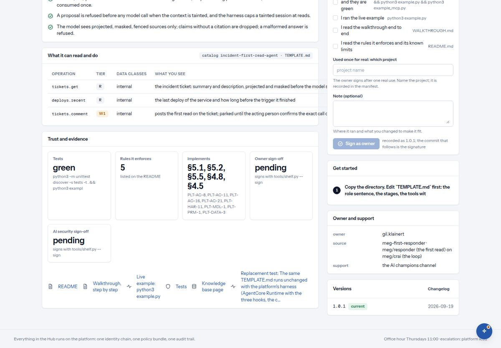

# 4. A listing page

*What it does, what it may do, who signed it.*

*An agent's listing, scrolled to 'What it can read and do': the whole permission list, with a tier on every row, and the sign-off card beside it.*

| You see | It means |
| --- | --- |
| Breadcrumb `Discover / Agents / …`, the name and a one-line summary | Where you are and what this thing is, in the words of the people who made it. |
| Header chips: `road R1` `python` `agent · ready` `spec §5.1, §5.2…` | The road, the language, its readiness, and which parts of the platform design it implements. A component of the collection also shows its tags. |
| `Open in the portal` · `Try in playground` | Use it for real as yourself, or try it in the sandbox with your playground key (section 6). |
| Tiles: `Template` `Tools` `Harness` `Language` `Status` `Pairs with` | For an agent: it has one template, which tools it calls, which harness it runs inside. Language says "standard library only" when nothing has to be installed. Pairs with lists the components it is usually used with. |
| `What it does` | Three to five plain sentences. For an agent they always say what it will not do, for example "it never posts on its own". |
| `What it can read and do` · columns `Operation` `Tier` `Data classes` `What you see` · chip `catalog … · signed` | The whole permission list. Each row is one thing it may call, with its tier. Nothing outside this table can run; the list is signed, so it cannot change quietly. |
| `Sign-off` card: `Owner` `AI security` `Stage`, chips `pending` `signed` `stale` | Who has signed this version and who has not. Stale means someone signed an older version; a change makes a signature stale until it is renewed. If you may sign, the form appears right here (section 8). |
| `Get started` | Numbered steps for an engineer: copy the directory, edit the template first, run the example. |
| `Owner and support` · `owner` `source` `support` | The person who signs as owner, where the component came from, and where to ask (the champions channel). |
| `Versions` · `Changelog` · chip `current` | Every version and its date. A new version asks both signers again. |
| `Trust and evidence` · `Cost and usage` | For the bank's own services: the evaluation, the audit trail links, weekly users, task success, and the outcome metric against its baseline. |
| `No operations are recorded for this listing.` | This listing has no tools at all, for example a knowledge service. It can read, not act. |

> **Note.** The rule behind the table: `R` runs. `W1` is parked until the person using it confirms that exact action, once. `W2` needs a second, named person. `MONEY` is refused outright. If the text the agent read contained instructions, the session is marked as tainted and can only read from then on.
