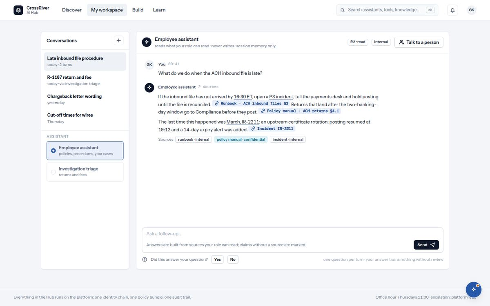

# 5. The employee assistant

*Ask in plain words. Every answer names the page it came from.*

*The employee assistant: an answer with its claims underlined and the page each came from, the sources row, and the feedback question.*

| You see | It means |
| --- | --- |
| `Conversations` · `+` · `No conversations yet.` | Your past conversations with this assistant, newest first. Plus starts a fresh one. |
| `Assistant` list on the left | The assistants and agents your role may talk to. `playground` after a name means you opened it in the sandbox. |
| Header line: `reads what your role can read · never writes · session memory only` | Three promises. It reads only what you could read yourself, it cannot change anything, and it forgets when the session ends. |
| `Ask a follow-up…` · `Send` · `Stop` | Type, press Send. Stop ends an answer mid-way and the record notes that you stopped it. |
| `Answers are built from sources your role can read; claims without a source are marked.` | The line under the box. It is the assistant's whole method in one sentence. |
| An answer with underlined phrases and chips like `Runbook · ACH inbound files §3` | Each underlined phrase is a claim, and the chip beside it is the page it came from. A phrase shown differently, with the hint `No source supports this claim`, is unsupported: read it as a hint, not a fact. |
| `Sources` row with chips like `runbook · internal` `policy manual · confidential` | Every page used, with its classification, so you know what the answer was allowed to see. |
| A step line such as a search the assistant ran | It shows its work: what it looked up before answering, so you see what it did, not only what it said. |
| `budget 2.1K of 8K tokens · 2 of 6 calls · 12s of 60s` | Every conversation has a budget of tokens, calls and time. This line is how much of it the answer used. |
| `Stopped.` · `Confirmation needed.` · `Handed to a person.` | The assistant stopped (you pressed Stop, or a page read as an instruction and it refused to use it), a step needs your yes on screen, or the conversation went to a person. |
| `Did this answer your question?` `Yes` `No` · `one question per turn · your answer trains nothing without review` | The one thing we ask of you. It goes to the assistant's owner as a labelled example; nothing learns from it on its own. |
| `Talk to a person` | Hands the conversation to a person and tells you the expected wait. |
| `That assistant is not open to your role.` · `Ask for access from its listing; the platform lead confirms within two working days.` | You opened an assistant you may not use yet. Request it from its listing. |

1. **Open the assistant from Discover, your workspace, or by typing a question into search.**  
   A question typed into ⌘K arrives ready to send.
2. **Ask the way you would ask a colleague.**  
   Whole sentences work best: "What do we do when the inbound file is late?"
3. **Read the chips before you trust the answer.**  
   A claim with a page beside it is grounded. A phrase marked unsupported is not.
4. **Answer Yes or No under the answer.**  
   That one click is how we measure whether the assistant is any good.
5. **If it said it stopped because a page looked like an instruction, rephrase or open the page yourself.**  
   That is the protection working: something in a page was trying to steer it.
