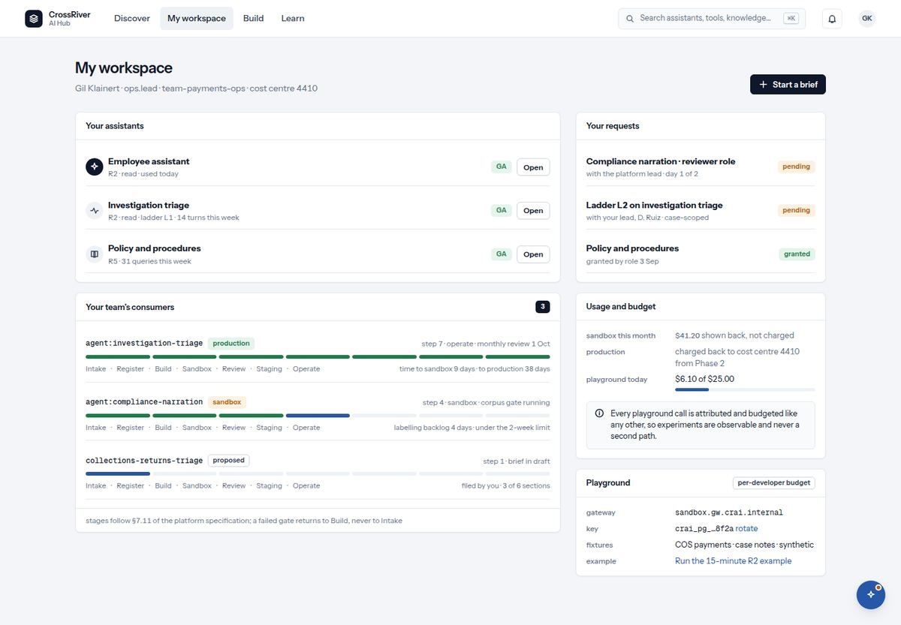

# 6. My workspace

*What is yours: assistants, your team's services, your requests, your usage, the playground.*

*My workspace: your assistants, your team's consumers, your requests, usage and the playground.*

| You see | It means |
| --- | --- |
| `My workspace` · your name · role · team · `cost centre …` | Who the platform thinks you are, and whose budget your usage lands on. |
| `Start a brief` | The same button as on Discover: propose a new use of AI. |
| `Your assistants` · `Nothing yet. Open an assistant from Discover and it appears here.` | Assistants you have used, with Open buttons. |
| `Your team's consumers` · `stages follow §7.11 of the platform specification; a failed gate returns to Build, never to Intake` · `Your team has nothing on the platform yet. A brief is the way in.` | What your team is building and how far along each one is. The stages run Intake, Build, Sandbox, Evaluate, Production. A failed check sends it back to Build, never to the beginning. |
| `Your requests` · `No requests. Ask for access or a higher ladder from a listing.` | Every access request you made and where it stands: pending, granted, denied. |
| `Usage and budget` · `sandbox this month` `production` `playground today` with a bar | What you used, shown back to you. Nothing runs against a budget it does not have. |
| `Playground` · `per-developer budget` · `gateway` `key` `rotate` `fixtures` `example` | For engineers: the sandbox gateway address, your own key (masked), a rotate button, the test data and an example command. `Every playground call is attributed and budgeted like any other, so experiments are observable and never a second path.` |
| `Playground key rotated.` · `The previous key stops working in 10 minutes.` | After pressing rotate. Update the key in your terminal within ten minutes. |
