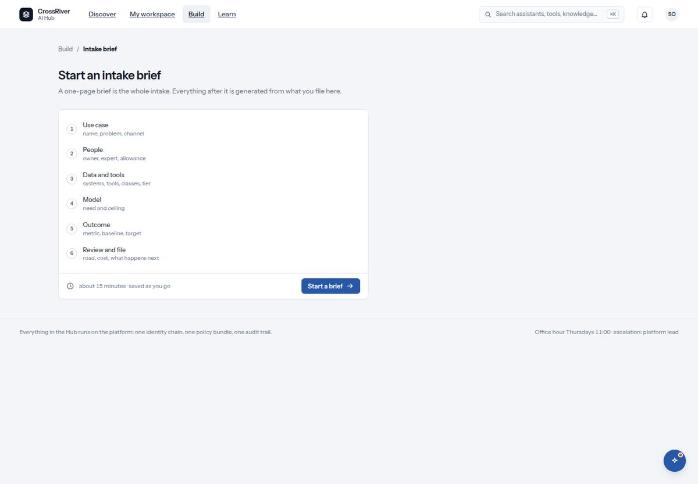
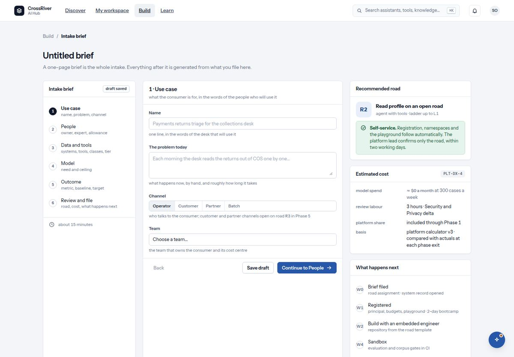
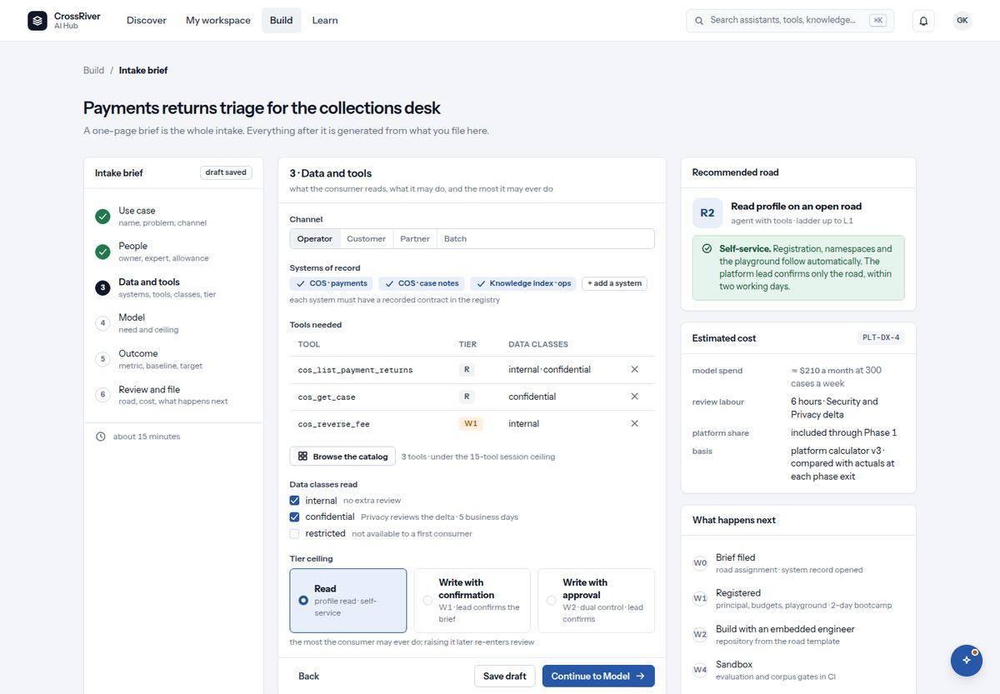
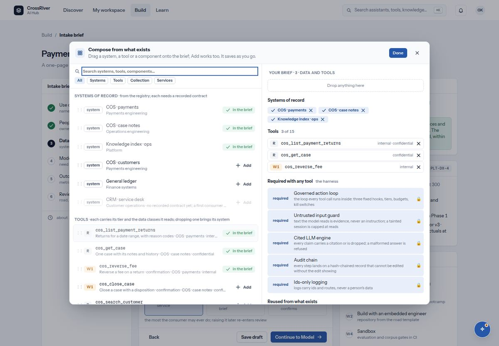
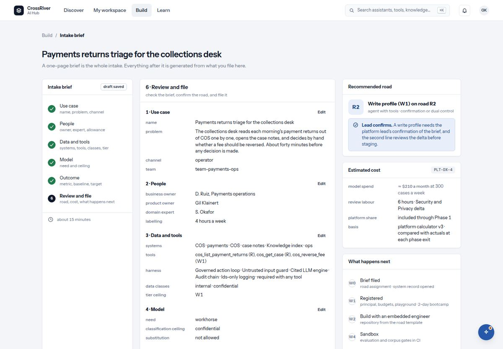

# 7. Build: the intake brief

*One page in six sections. It saves as you go, and it is the whole intake.*

*Where a brief begins for someone with no draft: the start screen lists the six sections and one button, Start a brief.*

*After Start: a new draft on section 1, Use case. Name, the problem today, channel and team; the road and the estimate on the right are empty until you write.*

*The demo person's saved draft, which opens where it was left, on section 3. The hub reopens your latest draft at its own step, so this is what a returning person sees, not where a brief starts.*

*The composer, opened from 'Browse the catalog': everything that exists on the left, the brief on the right, the harness locked under 'Required with any tool', and 'What this means' below.*

*Review and file: the whole brief read back, with the harness named beside the tools.*

| You see | It means |
| --- | --- |
| `Start an intake brief` · `A one-page brief is the whole intake. Everything after it is generated from what you file here.` · `about 15 minutes · saved as you go` · `Start a brief` | The first screen when you have no draft. The six sections are listed with one line each. Pressing Start creates the draft and opens section 1. |
| `A brief names the team that owns it. You are in no team yet; ask your lead to add you, then start here.` | In place of Start a brief, when the platform lists you in no team. A brief cannot be created without the team that owns it; once your lead has added you, the button is back. |
| The rail on the left: six numbered sections, ticks on the ones done | Where you are. You may go back to any section. When you come back to Build later, your latest draft reopens at the section you left it on, not at section 1. |
| `Back` · `Save draft` · `Continue to …` | Continue checks the section and moves on. Save draft is for leaving; the brief also saves itself about a second after every change. |
| Save states: `saved` · `saving…` · `unsaved changes` | Shown near the title. Nothing is lost if you close the tab once it says saved. |
| `This draft was saved from another tab.` · `Reload to see the latest version; edits made here since are not saved.` · `Reload the draft` | Two tabs edited the same brief. The hub stops saving here rather than overwrite the other tab. Reload and continue. |
| Right rail: `Recommended road` · `Estimated cost` (`model spend`, `review labour`, `platform share`, `basis`) · `What happens next` | Worked out live from what you have written: which road fits, roughly what it costs a month, and what follows filing. They update as you type. |
| `The brief is not complete` · `Some sections need attention before it can be filed.` | A section is missing something. The field is marked; the rail shows which section. |
| `Your team lead files this brief.` · `Lead confirmation.` | If your brief lets an AI change a system rather than read one, only a team lead may file it. The form says so on the review step. |
| `The platform lead confirms the road within two working days; registration, namespaces and the playground follow. Track it in my workspace.` | What you see after filing. Nothing else is asked of you until the lead answers. |

## The six sections, field by field

### 1. Use case `name, problem, channel`

`Name`: one line, in the words of the desk that will use it. `The problem today`: what happens now, by hand, and how long it takes. `Channel`: who talks to it (operator, customer, partner, batch); customer and partner channels open on road R3. `Team`: the team that owns it and its cost centre; when you are in no team the field says `You are in no team yet. Ask your lead to add you; a brief needs the team that owns it.` and the section will not pass until you are.

### 2. People `owner, expert, allowance`

`Business owner`: accountable for the outcome; signs the monthly review. `Product owner`: runs the build and the sandbox with the embedded engineer. `Domain expert`: labels the evaluation cases. `Labelling allowance`: hours a week the expert gives; under one hour stalls the corpus gate.

### 3. Data and tools `systems, tools, classes, tier`

`Systems of record`: pick from the registry (`+ add a system`); a system without a recorded contract cannot be named. `Tools needed`: what it calls, each with its tier; `Browse the catalog` opens the composer (below). `Reused from what exists`: the components and services the consumer builds on, once you have chosen some. `Data classes read`: internal, confidential, restricted. `Tier ceiling`: Read, Write with confirmation, or Write with approval: the most it may ever do.

### 4. Model `need and ceiling`

`Model need`: No generative model, Utility, Workhorse or Frontier. `Classification ceiling for the model`: the highest class of data it may see. `Substitution`: whether the platform may swap the model for an equivalent.

### 5. Outcome `metric, baseline, target`

`Outcome metric`: one number it is meant to move, for example minutes per case. `Unit`, `Baseline today`, `Target`, `Baseline measured on`: older than a quarter and the lead asks for a fresh one.

### 6. Review and file `road, cost, what happens next`

The whole brief read back, the road to confirm, the estimate, and one box: `I have read what happens next and the estimated cost`. Then `File`.

## The composer: build from what exists

| You see | It means |
| --- | --- |
| `Compose from what exists` · `Drag a system, a tool or a component onto the brief; Add works too. It saves as you go.` | The dialog "Browse the catalog" opens in section 3. Left: everything that exists. Right: your brief's section 3. Nothing here is a separate model; it edits the brief directly. |
| Search box and filters `All` `Systems` `Tools` `Collection` `Services` | Narrow the palette. It only lists what your role may see. |
| Groups: `Systems of record` · `Tools` · `The collection` · `The bank's services` | The registry's systems (each needs a recorded contract), the tools each system offers with their tier and data classes, the collection's reusable components, and the assistants, agents and knowledge services already on the platform. |
| A row with a grip `⋮⋮`, a chip such as `R` `W1` `GA` `preview`, and `+ Add` or `✓ in the brief` | Drag the row onto the right side, or press Add. GA on a component means two named people signed this version; preview means it is still earning them. "In the brief" means it is already there. |
| A greyed row: `no recorded contract yet; a first consumer cannot name it` | That system cannot be added until its owner records a contract. Dragging it does nothing. |
| `Drop anything here` / `Drop to add it to the brief` | The whole right side is the drop zone; it lights up while you drag. |
| `Tools 4 of 15` · `Reused from what exists` | Your tools against the 15-tool session ceiling, and the components and services you are building on. The × on any chip or row removes it. |
| `WHAT THIS MEANS`: `Highest tier so far: W1 · the ceiling is Read, which does not cover it.` `Set the ceiling to Write with confirmation` | The consequences, live. One button per fix: raise the ceiling, tick the internal and confidential classes the tools read. Restricted is never a tick away (next row). It also says whether a lead will have to file, how many tools you have left, and that a money tool is refused for a first consumer. |
| `… reads restricted data, which a first consumer cannot use`; `remove it or take the use case to the platform team for a data-class exception` | The one line with no fix button. A tool that reads restricted data cannot be in a first consumer's brief: remove the tool, or take the use case to the platform team for a data-class exception. |
| `Required with any tool · the harness`: five locked rows, `required` and a 🔒: Governed action loop, Untrusted input guard, Cited LLM engine, Audit chain, Ids-only logging · `Every tool runs inside the governed action loop; the guard, the engine, the chain and ids-only logging come with it.` | The harness baseline. It appears as soon as the brief names a tool and cannot be removed. Filing writes it into the brief, on the hub and again on the platform, so no solution that calls a tool is ever recorded without its harness. In the palette these components read as `required` rather than offering Add. The review page lists them under `harness`. |
| `cos_get_case brought COS · case notes with it` | Dropping a tool adds its system of record too, when that system has a contract. |
| `Done` | Closes the composer. Everything is already in the brief and saving itself. |

1. **In section 3, press "Browse the catalog".**  
   The composer opens over the brief.
2. **Drag a tool onto the right side, or press Add.**  
   Its system comes with it. The tier chip tells you what the tool may do.
3. **Read "What this means" and press the fix buttons.**  
   The ceiling and the internal and confidential classes are set for you; the road on the brief's right rail updates. A tool that reads restricted data has no button: remove it, or take the use case to the platform team.
4. **Add the components and services you build on.**  
   A signed one is review time saved; it appears under "Reused from what exists" in the brief and on the review page.
5. **Press Done and continue to section 4.**  
   Nothing else to save.

## Filing it, step by step

1. **Build → "Start a brief".**  
   A draft is created and section 1 opens. From now on it saves itself.
2. **Fill each section and press "Continue".**  
   Continue checks the section with the same rules the server applies, so you never reach an error you could not see.
3. **Watch the right rail.**  
   The recommended road and the estimate update as you write. If the road surprises you, section 3's tier ceiling is usually why.
4. **On "Review and file", tick the confirmation and press "File the brief".**  
   If a lead has to file it, hand it over: your draft is in their workspace under the team's consumers.
5. **Read the message and go to My workspace.**  
   The lead confirms the road within two working days. The consumer then appears under your team's consumers at its stage.
