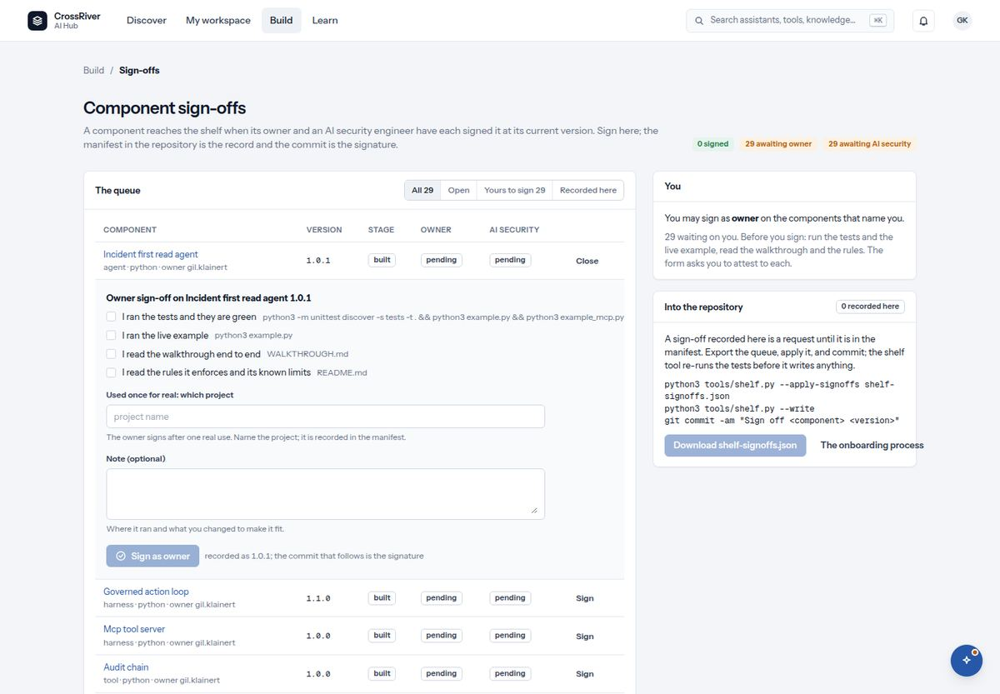

# 8. Build: sign-offs

*Two named people per version. The commit is the signature.*



*The sign-off queue with the form open in a row: four attestations, the project of the first real use, and the note.*

| You see | It means |
| --- | --- |
| `Component sign-offs` · `A component reaches the shelf when its owner and an AI security engineer have each signed it at its current version. Sign here; the manifest in the repository is the record and the commit is the signature.` | The page's whole idea. The hub records your sign-off; the repository is where it becomes a record. |
| Chips: `3 signed` `26 awaiting owner` `0 awaiting AI security` | The state of the shelf at a glance. |
| `The queue` · filters `All` `Open` `Yours to sign` `Recorded here` · columns `Component` `Version` `Stage` `Owner` `AI security` · `Sign` | Every component with its version and both sign-offs. "Yours to sign" shows what waits on you. Sign opens the form in the row. |
| Sign-off chips: `pending` · `a name · a date` · `awaiting commit` · `stale: signed at 1.0.0` | Not yet signed; signed in the repository at this version; recorded here and not yet committed; signed at an older version and needed again. |
| `You` card: `You may sign as Owner` / `You sign nothing yet. Owners sign by name … AI security engineers sign by the ai.security role.` · `How to become either` | Who you are to the queue. The owner is the person named in the component; AI security is a role your security lead grants. |
| The form: `I ran the tests and they are green` · `I ran the live example` · `I read the walkthrough end to end` · `I read the rules it enforces and its known limits` | Four attestations. The server refuses a form with one unticked, so they cannot be skipped by calling the API directly. |
| `Used once for real: which project` · `The owner signs after one real use. Name the project; it is recorded in the manifest.` | The owner's extra field on a component's first sign-off. No project, no owner sign-off. |
| `Note (optional)` · `What you looked at hardest, and anything the owner should fix in the next version.` | For the AI security engineer especially: say what you checked. |
| `Recorded: owner sign-off on … 1.0.1.` · `Export the queue and apply it with the shelf tool; the commit is the signature.` | The toast after signing. Your sign-off is a request until an engineer commits it. |
| `Into the repository` · `A sign-off recorded here is a request until it is in the manifest. Export the queue, apply it, and commit; the shelf tool re-runs the tests before it writes anything.` · `Download` | The engineer's step. The downloaded file is applied with one command; the tool tests again before writing. |
| `A sign-off needs a ready component; this one is draft.` · `Already signed` | Reasons a form will not open: the component is not built yet, or this version already carries your signature. |

### If you are an owner

1. Use the component once for real.
2. Run its tests and its example; read its walkthrough and rules.
3. Build → Sign-offs → "Yours to sign" → Sign.
4. Tick the four boxes, name the project, sign.
5. Tell the engineer who commits.

### If you are an AI security engineer

1. Ask your security lead for the AI security role.
2. Read the practices the components enforce.
3. For each component: rules, walkthrough, tests, example.
4. Sign, and write in the note what you looked at hardest.
5. For an agent, read its never list against its tests, one test per line.

### If you commit it

1. Sign-offs → "Into the repository" → Download.
2. 

   ```bash
   python3 tools/shelf.py --apply-signoffs shelf-signoffs.json
   python3 tools/shelf.py --write
   git commit
   ```
3. The tool re-runs the tests first and refuses if they fail.

> **Warning.** Nothing here is ever written by hand or invented. A pending sign-off stays pending until a named person gives it, and a new version makes the old signature stale until both sign again.
