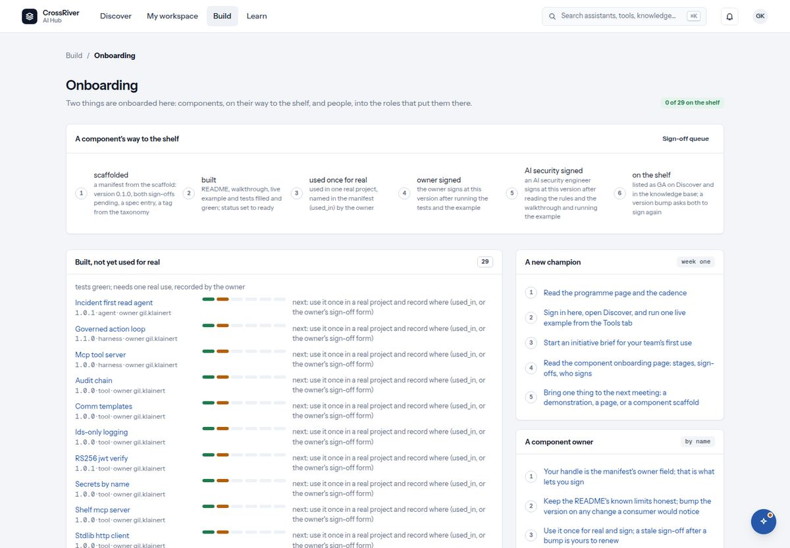

# 9. Build: onboarding

*Components on their way to the shelf, and people into the roles that put them there.*

*Onboarding: the six stages, every component under the group that says what happens next, and the checklists for people.*

| You see | It means |
| --- | --- |
| `Onboarding` · `Two things are onboarded here: components, on their way to the shelf, and people, into the roles that put them there.` · `3 of 29 on the shelf` | The page and its count. |
| `A component's way to the shelf`: six numbered stages | Read from each component's own facts, never guessed. Each stage names what proves it. |
| Groups: `On the shelf` · `Awaiting AI security sign-off` · `Awaiting owner sign-off` · `Built, not yet used for real` · `Scaffolded` · `Deprecated` | Every component under the group that says what has to happen next, furthest along first. |
| Checklists: `A new champion, week one` · `A component owner` · `An AI security engineer` · `What the enablement lead keeps` | What each person does first. The same words as the knowledge base's onboarding page. |

1. **Scaffolded**  
   A directory with version 0.1.0, both sign-offs pending, and placeholders for the README, walkthrough, example and tests.
2. **Built**  
   README, walkthrough, live example and tests filled and green; status set to ready.
3. **Used once for real**  
   Used in one real project, named by the owner on the sign-off form.
4. **Owner signed**  
   The owner signs at this version after running the tests and the example.
5. **AI security signed**  
   An AI security engineer signs at this version after reading the rules and the walkthrough and running the example.
6. **On the shelf**  
   Listed as GA on Discover and in the knowledge base. A version bump sends it back to stage 3.
