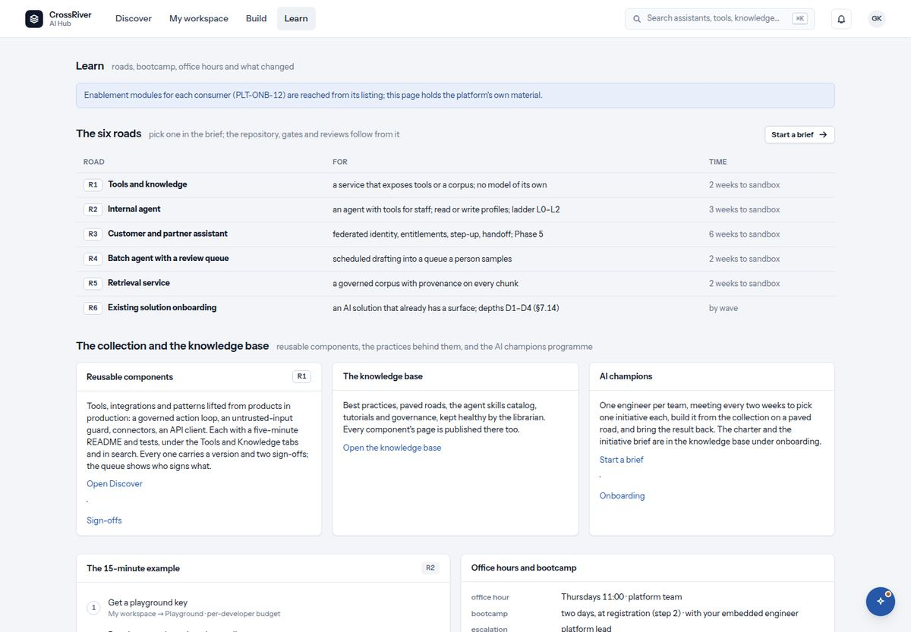

# 10. Learn

*The six roads, the collection, the programme, and the fifteen-minute example.*

*Learn: the six roads, the collection and the knowledge base, the fifteen-minute example, office hours.*

| You see | It means |
| --- | --- |
| `The six roads` · `pick one in the brief; the repository, gates and reviews follow from it` | A table of Road, For and Time. R1 tools and knowledge (no model of its own). R2 an internal agent for staff. R3 a customer and partner assistant. R4 a batch agent with a review queue. R5 a retrieval service with provenance on every chunk. R6 onboarding an AI solution that already exists. |
| `The collection and the knowledge base`: cards `Reusable components` · `The knowledge base` · `AI champions` | What the collection is (tools, integrations and patterns lifted from products in production, each with a five-minute README, tests, a version and two sign-offs), where the practice pages live, and the programme in one paragraph. Links: `Open Discover`, `Sign-offs`, `Open the knowledge base`, `Start a brief`, `Onboarding`. |
| `The 15-minute example` | Three steps: get a playground key from My workspace; run the example against the sandbox gateway (every call is attributed to you); change one tool and run again to see the policy decision, the audit entry and the cost. |
| `Office hours and bootcamp` | The weekly office hour, the two-day bootcamp at registration with your embedded engineer, and who to escalate to. |
