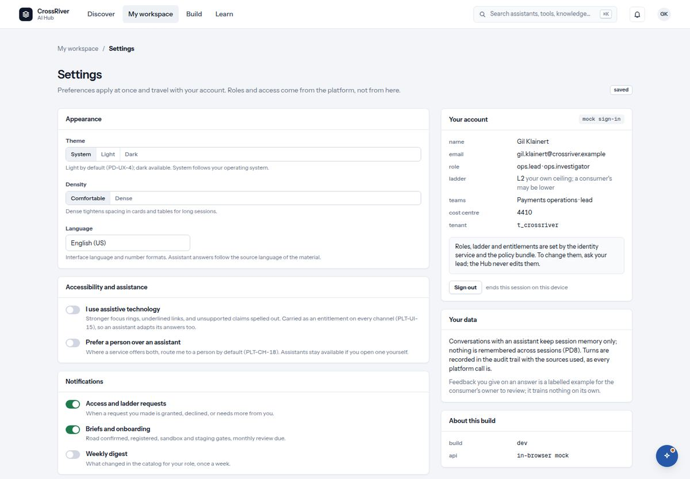

# 11. Settings

*Preferences apply at once and travel with your account. Roles do not come from here.*

*Settings: appearance, accessibility and assistance, notifications, your account, your data.*

| You see | It means |
| --- | --- |
| `Appearance`: `Theme` (System, Light, Dark) · `Density` (Comfortable, Dense) · `Language` | Light by default, dark available; System follows your operating system. Dense tightens spacing for long sessions. Assistant answers follow the language of the material, not this setting. |
| `Accessibility and assistance` | Declare that you use assistive technology, so every channel carries it. And decline AI assistance altogether: conversations then route to a person by default. |
| `Notifications`: requests · briefs · digest | Whether you hear about your requests, your briefs and the weekly digest. |
| `Your account`: name, email, role, ladder (`your own ceiling; a consumer's may be lower`), teams, cost centre, tenant · `Roles, ladder and entitlements are set by the identity service and the policy bundle. To change them, ask your lead; the Hub never edits them.` | Read-only facts about you. The hub cannot change your access; that is the point. |
| `Your data` | Conversations keep session memory only; turns are recorded in the audit trail with the sources used. Feedback you give is a labelled example for the owner to review and trains nothing on its own. |
| `Sign out` · `ends this session on this device` | Exactly that. |
| `Your preferences could not be saved.` · `They are kept for this session only.` | The save failed; the choice still applies until you sign out. |
