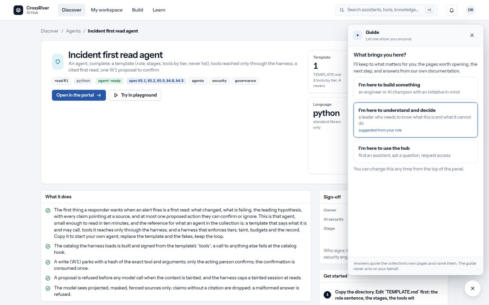
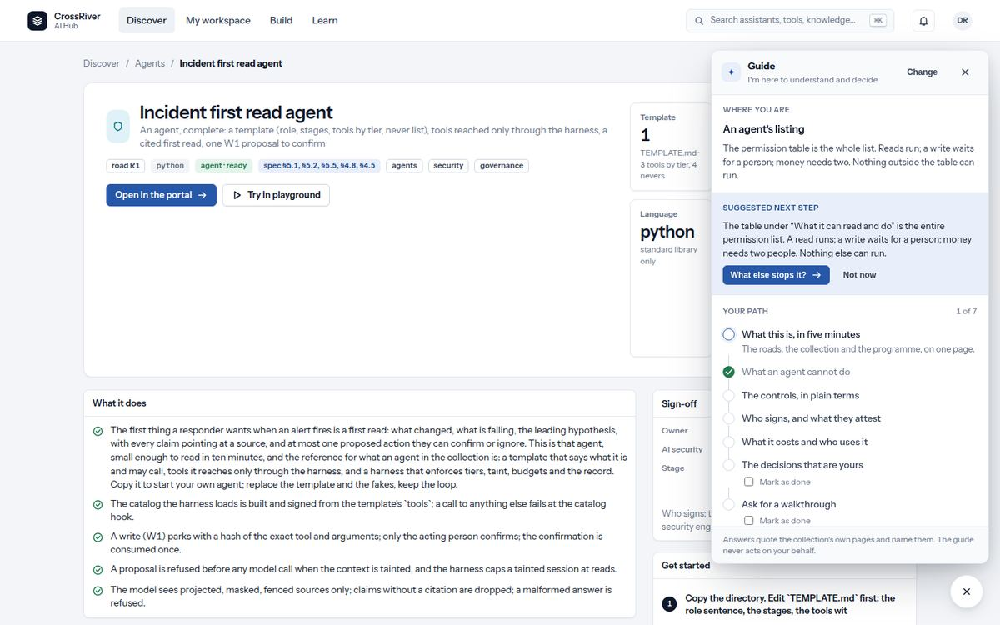
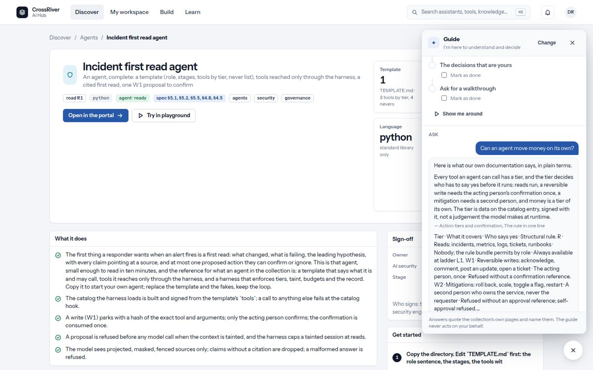
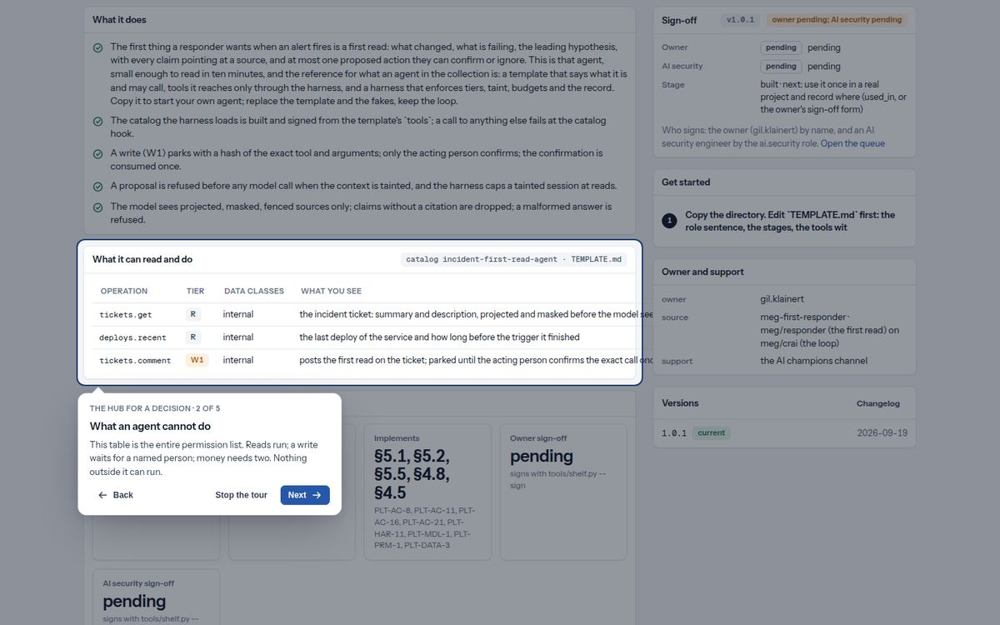

# 12. The guide

*The spark button at the bottom right. It knows who it is talking to and where you are.*

*The guide on first open: what brings you here, with one choice suggested from your role.*

*The guide for a leader on an agent's listing: where you are, the suggested next step, the path, and a place to ask.*

*An answer: quoted from our own pages, each passage attributed, the sources listed.*

*The tour: the page dimmed, the part that matters lit up, one sentence on it, Back and Next.*

| You see | It means |
| --- | --- |
| A round blue button with a spark, bottom right; a small amber dot on it | The guide. Alt+G opens it too. The dot means a next step is waiting for you. |
| A small box beside it: `NEXT STEP` · `New here? Tell me what you're here for and I'll point you at the pages that matter…` | The guide speaking first. It shows once per suggestion and goes quiet on its own; the × means "not now" and it will not ask again. |
| `What brings you here?` · `I'm here to build something` · `I'm here to understand and decide` · `I'm here to use the hub` · `suggested from your role` | The first question, asked once. One is highlighted from your role. `Change` at the top of the panel changes it later. |
| `WHERE YOU ARE` and a title | One line on the page you are on, written for the choice you made. A leader on an agent's page reads that the permission table is the whole list; a builder reads where the evidence links are. |
| `SUGGESTED NEXT STEP` · a button · `Not now` | One suggestion, worked out from your own records: a brief you left half-finished, components waiting for your signature, a page you have not opened. Not now dismisses it for good. |
| `YOUR PATH` · `2 of 8` · steps with a green tick, a blue ring, or grey | Your journey. Green is done (the hub knows, from what you did), blue ring is the current step, grey is later. Clicking a step takes you there. `Mark as done` is for steps only you can know about, such as running a command; the command is shown under it. |
| `Show me around` · then `THE HUB FOR A DECISION · 2 OF 5` · `Back` `Stop the tour` `Next` `Done` | The tour. It moves you page by page and lights up the part that matters, with a sentence on it. Arrow keys move; Escape stops; you keep the page you are on. |
| `ASK` with starter chips such as `What stops an agent doing something we did not ask for?` | Questions people ask most, chosen for your persona. Click one or type your own. |
| An answer starting `Here is what our own documentation says, in plain terms.` or `From the repository's own pages:`, with `— Action tiers and confirmation, The rule in one line` under each passage, and `SOURCES` chips | The guide quotes our own pages and names them. It never makes up a sentence about the platform. A "Go to" chip after the answer takes you to the page that covers it. |
| `I couldn't find that in our own documentation, so I won't guess…` | The pages do not cover it. Ask the programme lead, or it goes on the open-decisions list. |
| `That reads as an instruction rather than a question, so I won't act on it.` | Something typed looked like an attempt to steer it. It declines and asks for a question instead. |
| `Answers quote the collection's own pages and name them. The guide never acts on your behalf.` | The footer of the panel. It has no tools: it points and explains, it never changes anything. |

### The builder's path

See what is on the shelf → Open the reference agent → Run its five-minute example → Write an intake brief → File it with your lead → Build from components → Take your component to the shelf → Get it signed off.

### The leader's path

What this is, in five minutes → What an agent cannot do → The controls, in plain terms (a question) → Who signs, and what they attest → What it costs and who uses it → The decisions that are yours → Ask for a walkthrough.

### The everyday path

Find what you may use → Ask the employee assistant → Request access to something → Say whether an answer helped.

1. **Press the spark button, or Alt+G.**  
   The panel opens on the right; the page stays usable beside it.
2. **Pick what brings you here.**  
   Everything after keeps to that choice. Change it any time at the top of the panel.
3. **Take the suggested next step, or press "Show me around".**  
   The tour is two minutes and ends where you started.
4. **Ask anything, in your own words.**  
   The answer names the page it came from; open it if you want the rest.
