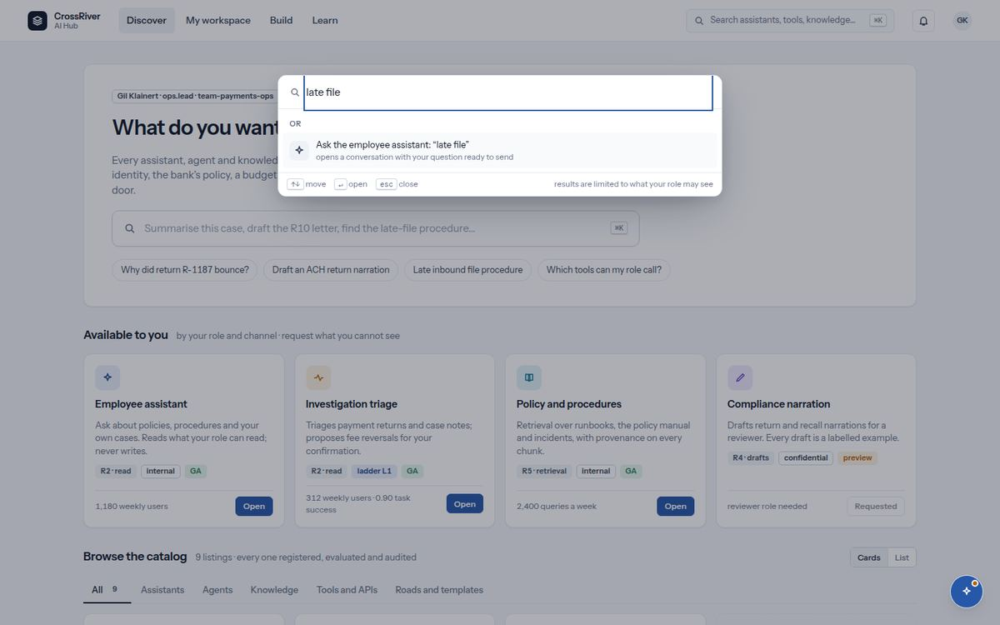

# 13. Search

*⌘K, or the box in the top bar.*

*Search (Ctrl+K) with a question typed: listings that match, places to go, and 'Ask the employee assistant'.*

| You see | It means |
| --- | --- |
| `Search assistants, tools, knowledge… or type a question` | One box, three things: listings, places in the hub, and a question for the assistant. |
| Group `Assistants, agents, knowledge and tools` | Listings that match, limited to what your role may see. Each shows its kind, road and lifecycle. |
| Group `Go to`: Discover · My workspace · Start or continue a brief · Component sign-offs · Onboarding · Learn · Settings · Sign out | Every place in the hub, so you never need the top bar. |
| Group `Or`: `Ask the employee assistant: "…"` | Anything longer than two letters can be sent to the assistant as a question, ready to send. |
| `↑↓ move · ↵ open · esc close` · `results are limited to what your role may see` | The keys, and the one rule. |
