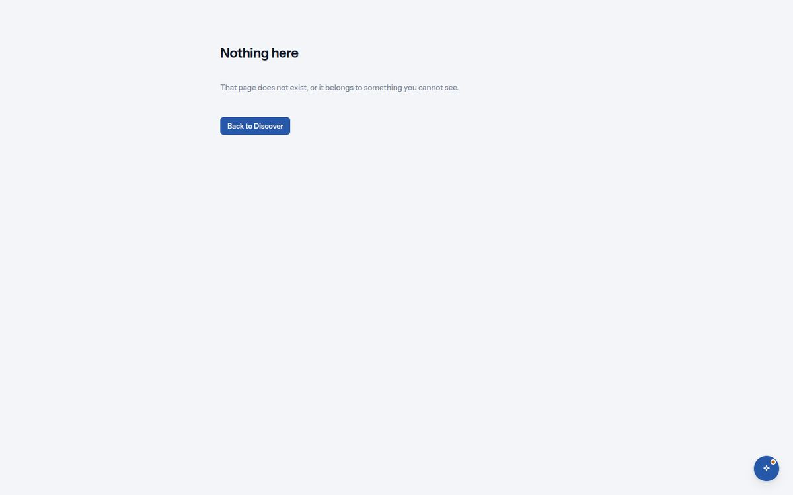

# 14. Messages you may see

*Every toast, error and empty state, and what to do about it.*

*'Nothing here': the page for a link that does not exist or belongs to something you cannot see.*

| You see | It means, and what to do |
| --- | --- |
| `Request sent.` | Your access request is with your lead. Follow it in My workspace. |
| `Already yours` · `You already have access to …; open it from Discover.` | You asked for something your role already opens. Nothing was sent; open it from Discover. |
| `Already asked` · `Your request for … is with your lead; there is nothing to send again.` | Your earlier request is still pending. Nothing was sent again; follow it under My workspace → Your requests. |
| `A brief names the team that owns it. You are in no team yet; ask your lead to add you, then start here.` · `You are in no team yet. Ask your lead to add you; a brief needs the team that owns it.` | The Build page, and the brief's Team field, when the platform lists you in no team. Ask your lead to add you; the brief waits. |
| `Recorded: owner sign-off on … 1.0.1.` | Your sign-off is recorded on the hub. An engineer commits it. |
| `Playground key rotated.` · `The previous key stops working in 10 minutes.` | Update the key where you use it. |
| `Your session has ended. Sign in again to continue.` | The token expired or was revoked. Sign in; you return to the same page. |
| `Your role does not allow this.` | Not open to your role. Request it from the listing, or ask your lead. |
| `That item does not exist or you cannot see it.` · `Nothing here` · `That page does not exist, or it belongs to something you cannot see.` | A wrong link, or something outside your access. |
| `This was changed by someone else. Reload and try again.` | The brief or record was updated elsewhere since you opened it. Reload; your last saved state is intact. |
| `Some answers need attention.` | A field is invalid. The field is marked with what is wrong. |
| `You are sending requests faster than the platform allows. Wait a moment and try again.` | A per-person limit. Wait the seconds shown; nobody else is affected. |
| `The platform hit a problem. It has been recorded; try again in a moment.` and a line such as `HTTP 503 · request 7f3a…` | Something on the platform failed. Quote the request id to support; it matches a line in the logs. |
| `Loading the catalog…` · `Opening the listing…` · `Reading the shelf…` · `Loading your briefs…` · `Loading your workspace…` · `Opening the assistant…` | Waiting on the platform. If it lasts, the matching "could not be loaded" line appears with a request id. |
| `The platform could not resolve your account.` | You signed in, but the platform has no record for you. Your lead adds your group to the identity map. |
| `This conversation has reached 200 turns; start a new conversation.` | The assistant's error banner shows the platform's sentence first. A conversation has a ceiling of 200 turns; press + for a fresh one, the old one stays in the list. |
| `Your role no longer opens this assistant.` | The same banner, when an entitlement was removed since you opened the conversation. Ask for access from the assistant's listing. |
