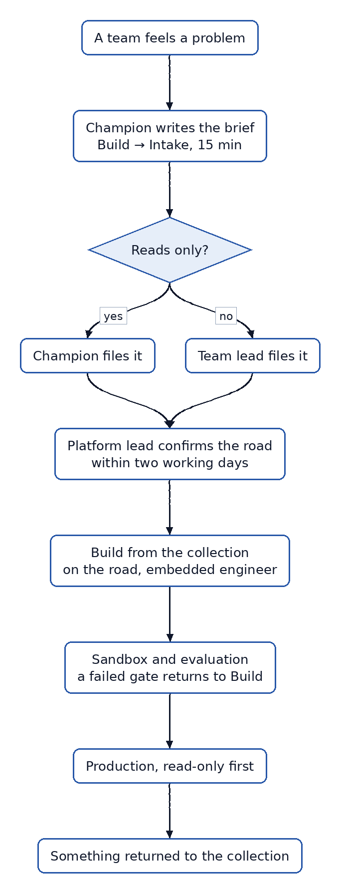
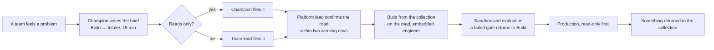
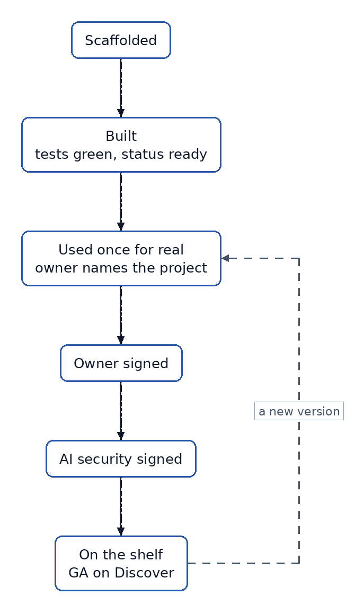
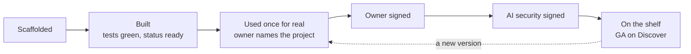
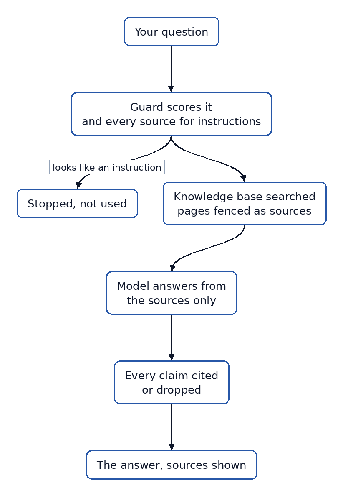
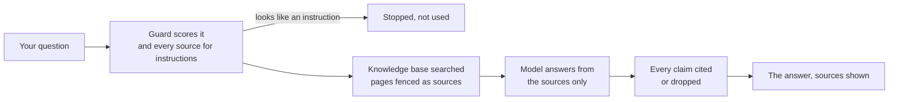
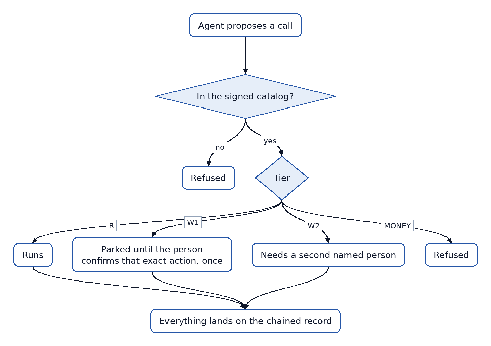
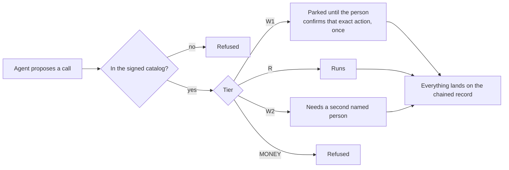

# 15. The processes, end to end

*Four pictures of how things move.*

## An initiative, from idea to production

## A component's way to the shelf

## How an answer is produced

## What stops an agent

